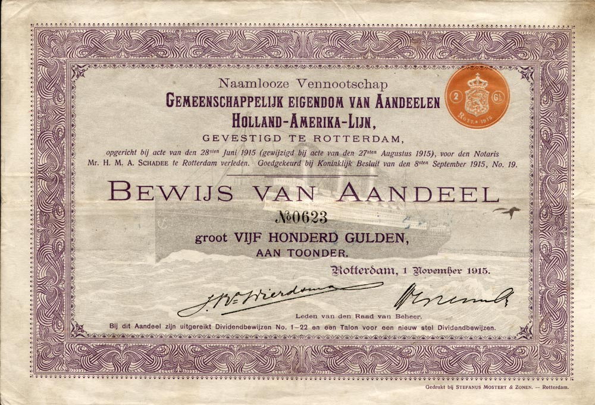
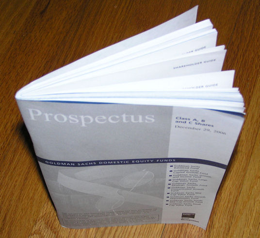

## 11 - Eigen vermogen

#### 11.1 Aandelenkapitaal

- Aandelenkapitaal hoort tot het **permanente** vermogen
- Maatschappelijk aandelenkapitaal = hoeveel aandelen er maximaal _statutair_ uitgegeven mogen worden.
- Geplaatst aandelen kapitaal = Aandelen in roulatie (verkocht)
- Je kan geplaatst aandelenkapitaal dus ook vinden door 

$$ maatschappelijk - aandelen~in~portefeuille$$

Aandeel is een bewijs van _deelname_ in het eigen vermogen van een vennootschap (BV/NV).
- Nominale waarde = waarde die op het aandeel staat
- Koerswaarde = de werkelijke momentele waarde afgeleid aan de beurs
- Emissiekoers = de waarde bij uitgifte van aandelen

Iemand die aandeel heeft in de vennootschap verwacht daarvoor een financiele beloning.
- Dividend = een uitkering van winst aan de aandeelhouders; bedrag per aandeel of percentage van de nominale waarde.
- Koerswinst = Koerswaarde gestegen ten opzichte van het moment van kopen.
- Tantieme = Winstuitkering voor mensen binnen het bedrijf.
- _Opties = Mogelijkheid tot het kopen van een aandeel tegen een eerder vastgestelde waarde._

#### 11.2 Preferent aandelenkapitaal

Preferent betekent _meer gewaardeerd_.
Dat kan uit verschillende dingen blijken:

- Winstuitkering: Vast percentage, als eerste.
- Zeggenschap: _Voordracht_ bestuursleden.
- Uitkering bij liquidatie: Eerder geld terug uit onderneming.

Voordelen voor de onderneming bij _gewone aandelen_:
- Hogere opbrengst.
- Preferente aandelen drukken de prijs van gewone aandelen.
- Lage betrokkenheid (minder zeggenschap) aandeelhouders.

#### 11.3 Emissie van aandelen

Prospectus; brochure bij het product

Eisen aan de prospectus door AFM:
- Doel van de emissie
- Overzicht resultaten verleden en verwacht
- Winstverdelingsmodel
- De emissiekoers
- Plaatsings- en betaaldatum

Herhaling **11.1** en nieuwe begrippen **11.3** :
- Nominale waarde = waarde die op het aandeel staat
- Koerswaarde = de werkelijke momentele waarde afgeleid aan de beurs
- Emissiekoers = de waarde bij uitgifte van aandelen
- **Agioreserve** = Reserve ontstaan door emissiekoers > nominale waarde.

**A pari**:

Emissiekoers = nominale waarde, geen agioreserve.

**Boven pari**:

Emissiekoers > nominale waarde, wel agioreserve.

**Beneden pari** (min 94%, AFM): 

Emissiekoers < nominale waarde, disagio.

#### 11.4 Reserves

- Winstreserve of Algemene reserve: Niet niet verdeelde winst, de onderneming _beslist zelf_ wat zij hiermee wil.
- Agioreserve: Ontstaan door emissie boven de nominale waarde, de onderneming beslist zelf wat zij hiermee wil, gebruikelijk is echter een uitkering in de vorm van _dividend_.
- Herwaarderingsreserve: Waardevermeerdering activa, het bedrijf dient deze te **herinvesteren** of er moet belasting worden betaald. (Vrijval herinvesteringsreserve, belastingdienst.nl)

Formele reserve = 

reserve aan de creditzijde van balans, m.a.w. je kunt aflezen hoe het bedrijf aan de reserve is gekomen.

Materiele reserve = 

bedragen aan de debetzijde van de balans die bedoeld zijn om op een later tijdstip uit te geven.

De formele reserve en de materiele reserve zijn niet per se elkaars evenbeeld.

_Waarom reserveren?_
- Weerstand
- Verhouding eigen vermogen tav vreemd vermogen
- Dividendstabilisatie
- Uitbreiding

#### 11.5 Intrinsieke waarde

_Waarde van binnenuit.._

- Intrinsieke waarde = Eigen vermogen
- Intrinsieke waaarde per aandeel = 

$$ \frac{Eigen~ vermogen}{geplaatste~ aandelen}$$

#### 11.6 Dividend

Dividend = een uitkering van winst aan de aandeelhouders; bedrag per aandeel of percentage van de nominale waarde.

Cashdividend = uitkering in contanten 

Stockdividen = uitkering in vorm van aandelen

Dividendpercentage = 

$$ \frac{div~ voor~ div.belasting}{geplaatst~ aandeelkapitaal} $$

_Let op!
Doordat we in Nederland dividendbelasting (15%) verschuldigd zijn, moet er altijd een deel uitgekeerd worden in cash-dividend._

Voorbeeld:
- Een aandeel heeft een nominale waarde 25 euro.
- Je hebt 400 van deze aandelen.
- Dividend is 15% waarvan 10% stock en 5% cash.
- Didivendbelasting is 15% (tot 2019)

_Wat krijg je nou?_

Uitwerking:
- 400 aandelen x 25 euro nominaal = 10.000 euro
- Daarover 15% dividend: 
- 0,15 x 10.000 = 150 euro totaal
- 0,10 x 10.000 = 100 euro stock (= 4 aandelen)
- 0,05 x 10.000 =  ~~50 euro cash~~
- 15% over 150 euro = 22,50
- cash dividend = 50 - 22,50 = 27,50 euro

Dus
- 4 aandelen a 25 euro nominaal = 100 euro
- 27,50 euro cash
- 22,50 euro betaald namens jou aan de fiscus
- Terugvorderbaar voor partijen anders dan vennoten!

## Einde

[printbare versie](havo_hfd11.html?print-pdf)

[home](index.html)