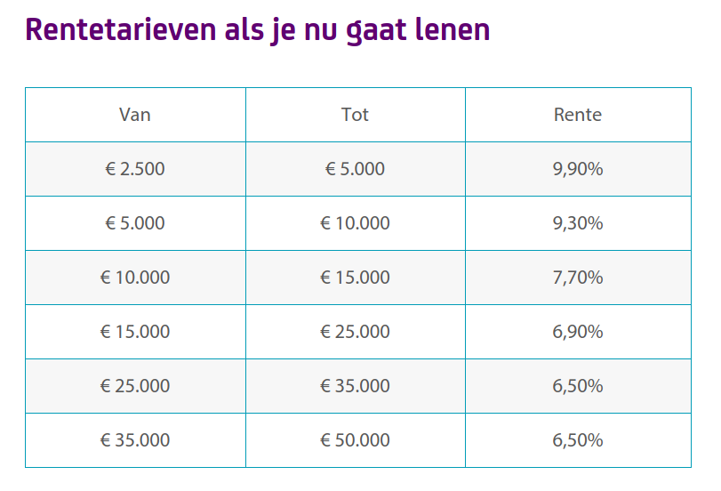

## Vreemd vermogen op korte termijn

#### 13.1 Leverancierskrediet

**Leverancierskrediet**: Vanuit de leverancier materialen geleverd krijgen waar je op een ander moment voor gaat betalen. 

**Productief leverancierskrediet**: In een productie-/handelsomgeving. De leverancier levert goederen/materialen aan een andere onderneming. Bedenk: _Betaaltermijn_ dus wezenlijk anders (vastgesteld) dan _crediteuren_..

Pluspunten:
- Lagere kosten dan bij bank
- Risico's lager door betere inschatting..
- Leverancier kent de branche!
- Lening volledig toegeschreven aan voorraad..

**Consumptief (leveranciers)krediet**

Voordelen voor leverancier (verlener):

- Koopdrempel verlagend!

- Binding van de klant, gehele duur van krediet.

- Minder administratiekosten dan bank, dus relatief goedkoop.

- Service naar klant toe (incident, gebrek aan spaargeld).

- Speelt in op product-levenscyclus, vernieuwing.

- Financieringskosten lucratief.

- Schulden zijn verhandelbaar.

#### 13.5 Consumptief krediet

**Doorlopend krediet**: 

- Krediet afgesproken met duur.

- Gedurende de hele looptijd (oneindig?!) kan het afgeloste weer opgenomen worden.

- Bedrag kan in delen worden opgenomen tot overeengekomen limiet.

- Aan de rente wordt flink verdiend!

SNS bank 10-10-2017:

**Koop op afbetaling**:

- Direct eigenaar!
 

= gebruik, vruchtgebruik, vervreemding

- Gelijke termijnen terugbetalen

- Wel of niet rente betalen

- Minstens 20% aanbetaling

- Geldig vanaf tweede termijnbetaling

**Huurkoop**:

- Pas eigenaar bij laatste termijn!

- Gelijke termijnen betalen

- Termijnen meestal iets hoger dan som/termijnen

- Geldig vanaf tweede termijnbetaling

_Incasso_
<section id="vid">
     <iframe src="http://www.youtube.com/embed/g2hCelKfUXQ?rel=0"
     frameborder="0" height="550" width="720"></iframe>
     </section>

**Persoonlijke lening**: 

- Krediet, betalingstermijnen en de interest afgesproken.

- De lenende partij _neemt het volledige bedrag op_ 

- Er wordt dan in _gelijke termijnen_ steeds een deel terugbetaald, die de consument weer op zou kunnen nemen. 

- Hoogte van de lening staat contractueel _vast_.

ING Bank 10-10-2017 (PL van 5000 euro):

<section id="vid">
     <iframe src="http://www.youtube.com/embed/yTYocsqNHGI?rel=0"
     frameborder="0" height="550" width="720"></iframe>
     </section>

#### 13.3 Rekening-courant
- Maximum afgesproken, vrij opneembaar

 = kredietplafond

- Betalen wanneer het uitkomt
- Daar staat (flink!) rente tegenover
- Steeds opnieuw opneembaar tot maximum

 = dispositieruimte

- Interessant voor (kleine) bedrijven in fluctuerende omstandigheden
- Gevaar dat bank vertrouwen opzegt..

**Anticipatiekrediet: **

Rekening-courant afgestemd op de emissie van aandelen (buffer).

#### 13.4 Leasing

Verschil tussen _operational_ en _financial_ lease.

**Operational lease**:

- Korte termijn opzegbaar

- Bijdrage in verzekering en onderhoud

- Opnemen in de w&v-rekening als kosten

- Off balance omdat het geen eigen activa zijn.

**Financial lease**:

- Schatting economische levensduur

- Op basis daarvan een overeenkomst

- Niet opzegbaar

- Onderhoud en verzekering voor eigen rekening

- Meestal na afloop voor klein bedrag te koop.

- On balance omdat het als het ware een koop betreft.

Stel dat jij voor jouw bedrijf auto's voor het personeel leaset, je hebt:

- 2 x parttimers (0,6 fte) in vaste dienst
- 3 x fulltimers met een jaarcontract

_Veronderstel dat de kosten bij operational en financial lease voor deze casus hetzelfde zijn.._

**Wat is de verhouding van operational/financial lease contracten als iedereen een auto moet?**

Nog niet ingevuld of 'onzinnig' ?

https://goo.gl/forms/0FBkkFfoPO13io2M2

## Einde

[printbare versie](havo_hfd13.html?print-pdf)

[home](index.html)