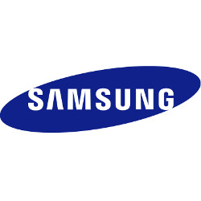

## Hoofdstuk 15 - Marketing

#### 15.1 Marketingaspecten

**Marketingbeleid:**

Alle activiteiten gericht op maximale behoeftebevrediging van de afnemers, passend binnen de organisatiedoelstellingen.

**Marketingdoelstellingen:**
- ten aanzien van de afzet
- ten aanzien van het marktaandeel
- ten aanzien van de winst
- ten aanzien van het imago

**4P's.. De marketingmix**

Product

Prijs

Plaats of distributie

Promotie of communicatie

**De andere P's..**

_Personeel_

_Periferie = Pheripheral clues bijv. vestiging/historie_

_Packaging = optimalisatie voor logistieke doeleinden_

_Partners bijv. co-branding, co-distribution, etc_

_Presentation bijv. de wijze waarop het bedrijf zich pres._

_Proces bijv. processen bij dienstverlening vs product_

_Physical evidence bijv. testimonials, recommendations, reviews_

_Philosophy_ bijv. strategie, filosofie, motto's

#### 15.2 Marketingaspecten

**Aankoopgedrag:**

- Routinematig aankoopgedrag **(RAG)**: convenience goods,  unsought goods
- Beperkt probleemoplossend aankoopgedrag **(BPO)**: shopping goods
- Uitgebreid probleemoplossend aankoopgedrag **(UPO)**: specialty goods

**4 typen:**

#### 15.3 Marktonderzoek en marktaandeel

** Marktonderzoek:**

_"Marktonderzoek is het systematisch onderzoek naar de afzetmogelijkheden van een bepaald product in een gebied gedurende een zekere periode."_ (p. 170)

**Deskresearch:**
Data die al bestaat, geen primair onderzoek.

   

 

**Fieldresearch:**
Data die nog niet bestaat, wel primair onderzoek.
- Enquete

- Interviews
- Observaties, eye-movement
- Labratoria
- Neurologisch

**Marktaandeel-afzet:**

$$ \frac{afzet~onderneming~in~branche}{totale~afzet~in~branche} $$

_NB. Verzorgingsgebied, periode_

**Marktaandeel-omzet:**

$$ \frac{omzet~onderneming~in~branche}{totale~omzet~in~branche} $$

_NB. Verzorgingsgebied, periode_

**Marktleider:** Ondernemer met het grootste marktaandeel.

**Marktpositie:** De situatie van een onderneming ten aanzien van de concurrentie.

#### 15.4 Marktsegmentatie

**Marktsegmentatie:** Het opsplitsen van de totale markt in delen. Delen van homogene deelmarkten.

**Homogene deelmarkten:** Een segment van de totale markt waarin de mensen hun behoefte opdezelfde manier bevredigd willen zien. 

**Ongedifferentieerde marketing:** 
- Hele markt of een heel groot deel,
- 1 product is gangbaar,  
- Marketingmix voor de hele markt,
- (Massaproductie)

**Gedifferentieerde marketing:** Marketingmix afstemmen op verschillende segmenten. Meer smaakjes.

**Geconcentreerde marketing:** Marketingmix gericht op een of een heel beperkt aantal deelmarkten. (Niche)

#### 15.5 Het merk

**Het merk..**

_"Brand"_

Onderscheid tussen..

Naam

Logo
 

Symbool

_Motto_

**Zouden jullie een top 5 meest waardevolle _(brand equity)_ merken kunnen benoemen?**

**Top 5:**

1. Google - $246 M

2. Apple - $235 M

3. Microsoft $143 M

4. Amazon $139 M

5. Facebook $130 M

**Top 6-10:**

6. AT&T - $115 M

7. Visa $111 M

8. Tencent - $108 M

9. IBM $102 M

10. McDonalds $98 M

**A- merk:**
- Hoge bekendheid (landelijk/mondiaal)
- Hoge brand equity / brand value
- Groot marktaandeel
- Gunstige positie in de winkel

**B- merk:**
- Minder bekend
- Minder waarde
- Minder marktaandeel
- Minder gunstige positie in de winkel

**Paraplu-merk:** Merk dat meerdere productsoorten biedt onder hetzelfde merk/logo. 

**Private-label:** Fabrikant maakt producten voor een ander merk, onder een andere naam. Bijvoorbeeld Unox die Hema-worsten maakt.

**Huismerk:** Eigen merk van de retailer/horeca.

#### 15.6 Marketing van niet commerciele organisaties

- Overheid : tv, kranten, websites
- Belangengroeperingen : magazines, sites, beurzen
- Onderwijs : billboars, websites, open-dagen, beurzen
- Liefdadigheid : wisselend
- Sportverenigingen : wisselend, prestaties..

#### Tip:
http://www.differencebetween.com/difference-between-brand-equity-and-vs-brand-value/

## Einde

[printbare versie](havo_hfd15.html?print-pdf)

[home](index.html)