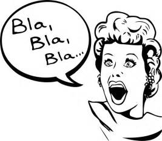

#### 17.1 Distributie

**Logistiek:** De weg die een product aflegt van begin naar eindpunt.

**Groothandel / wholesale:** Grote partijen bestemd voor handelaren.

**Detailhandel / retail:** Bestemd voor de consument  

Bedrijfskolom:

** Directe / indirecte distributie**

_Direct, indirect kort, indirect lang, indirect lang._

**Push- & Pulldistributie:** Distributie door retailers en wholesalers het te laten opnemen in het assortiment (push)of vraag creeeren bij de consument (pull).

#### 17.2 Logistiek ~~en voorraadsystemen~~

**Logistiek proces**

Kenmerken van logistiek (blz 191):
- Goederenstroom
- Informatiestroom (2 kanten op!)
- Factor: Afnemers
- Factor: Leveranciers
- Factor: Plaats en tijd (kosten)

~~**Logistieke systemen:**~~
- Voorraadgestuurd (bestelmoment voorraad < x)
- Ordergestuurd (stukproductie)
- Plangestuurd (massa, hoge aantallen)

**Afval, uitval, recycling, reverse logistics**

**JIT/JIC: Just in Time, Just in Case**
<section id="vid">
     <iframe src="http://www.youtube.com/embed/cAUXHJBB5CM?rel=0"
     frameborder="0" height="550" width="800"></iframe>
     </section>

#### Herhaling hoofdstuk 6 ZMBO

#### 6.1 Definitie van communicatie

**Functies:**
- Geven van informatie
- Verkrijgen van informatie
- Beinvloeden houding of gedrag

_ZMBO - model_

**Z**ender

**M**edium

**B**oodschap

**O**ntvanger

**Boodschap:**

1. Hoe wil ik overkomen?
2. Op welke manier benader ik de ontvanger(s)?
3. Wat zijn de gewenste reacties?

_Stel ik wil weten of de professional veel aan zijn eigen opleiding heeft gehad.._

Was school nog een beetje nuttig?

Heb je veel gehad aan hetgeen je geleerd hebt op school voor je huidige beroep?

Kon je makkelijk voortbouwen op de kennis die je hebt opgebouwd tijdens de opleiding om nieuwe kennis en vaardigheden te verwerven in je werk?

**Boodschap (2):**

1. Hoe wil ik overkomen? -> **Wat wil ik te weten komen?**
2. Op welke manier benader ik de ontvanger(s)?
3. Wat zijn de gewenste reacties?

#### 6.2 Uitbreiding van het ZMBO-model

**Coderen:** Idee, gedachten of gevoelens overbrengen. Eerst omzetten in een boodschap.

_Welke taal gebruik ik?_

_Welke voorbeelden gebruik ik?_

**Interpreteren & Decoderen**

**Referentiekader:** 

--------
- Biologische factoren
- Ervaringen
- Milieu
- Opvoeding
- Opleidingen
---------
Gevoelens, ideeen, meningen, opvattingen, normen en waarden..

**Feedback** (Ontvanger naar zender)
In de eerste instantie:
- Erkenning
- Begrip?
- **Antwoorden**

**Follow-up**

Verder met de boodschap (eerste deel is begrepen).

**Probeer het gesprek de volgende keer in te leiden!**

_Vorige keer hebben we het gehad over.._

_Ik herinner me nog dat je de vorige keer zei.._

#### Verstorende elementen in het ZMBO-model

#### Ruis
_"Ruis is iedere verstoring of ongunstige beinvloeding .. van een boodschap.."_

**Externe ruis:** Omgeving zorgt voor minder gunstige overdracht.

&nbsp;

**Interne ruis:** De oorzaak van de ruis ligt tussen de zender en de ontvanger met name bij het encoderen en decoderen.

**Non-intentonele ruis:** Onbedoeld

&nbsp;

**Intentionele ruis:** Bewust verstoren..

**Redundantie:** Overbodig

_Ik begrijp wat je zegt, maar ik ben eigenlijk op zoek naar.._

## Einde

[printbare versie](havo_hfd17.html?print-pdf)

[home](index.html)
