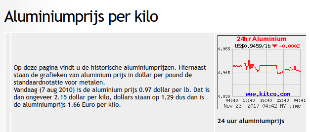
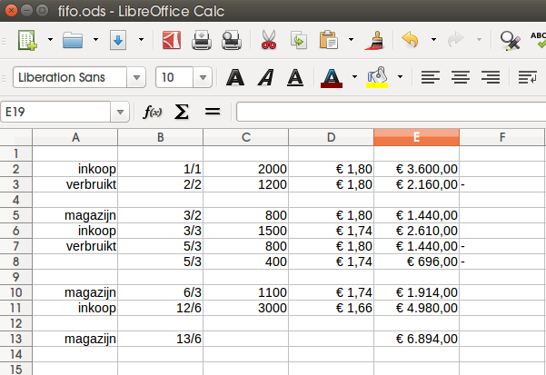
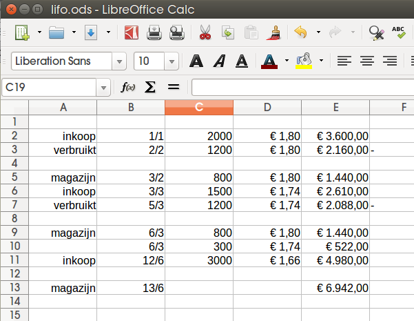
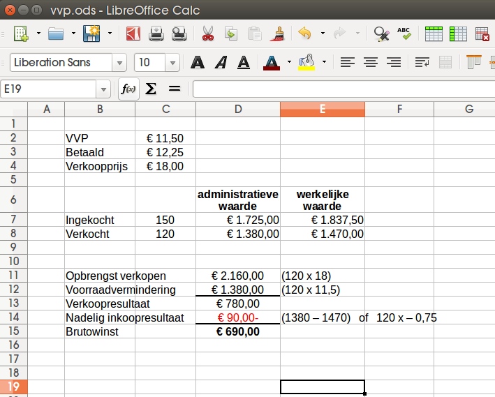
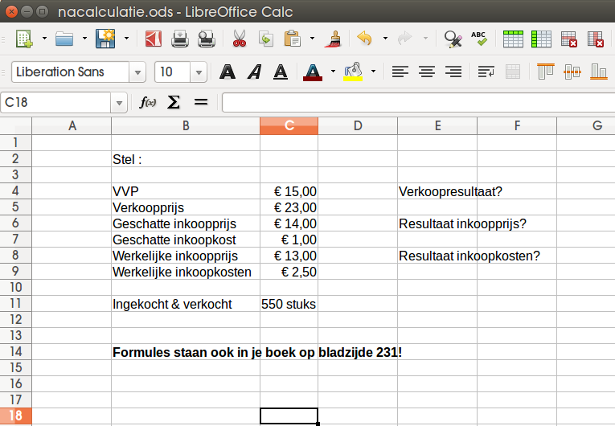

## 20 Voorraadregistratie en -waardering

#### Voorkennis

Wat is het verschil tussen en handelsonderneminig en een industriele onderneming?

Wat bedoelen we met prijsrisico?

Wat betekent speculeren?

## 20.1 Economische en technische voorraad

**Economische voorraad:** Voorraad in de boeken. Over deze voorraad loopt een bedrijf ook prijsrisico.

**Technische voorraad:** Daadwerkelijke voorraad. (Na inventarisatie..)

Stel: 

_100 artikelen in het magazijn, 10 verkocht maar nog niet geleverd, 50 nieuwe besteld maar nog niet ontvangen._

**Technische voorraad?**

**Economische voorraad?**

Stel: 

_Men verwacht dat de prijs van bepaalde grondstoffen zal toenemen volgende maand._ 

**Wat zal jouw bedrijf doen?**

Stel:

_Men verwacht dat de prijs van bepaalde grondstoffen zal afnemen volgende maand._

**Wat zal jouw bedrijf doen?**

## 20.2 | 20.3 FiFo & LiFo

**FiFo**

First in, first out

Producten aan derving onderhevig..

Stijgende prijzen -> hogere brutowinst

En vice versa!

Waardering tegen historische prijzen, niet de actuele prijzen

_Voorbeeld_

Je koopt op 1 januari **2000kg** aluminium a 1,80 euro, op 3 maart **1500kg** a 1,74 euro en 12 juni besluit je nog eens **3000kg** te kopen a 1,66 euro.

Op 2 februari heb je **1200kg** aluminium verwerkt in producten, op 5 maart heb je nogmaals **1200kg** aluminium verwerkt in producten.

- _Wat is de kostprijs van het alumium dat je vebruikt hebt op 5/3?_

- _Hoeveel bedraagt de waarde van de voorraad op 13 juni?_

_Uitwerking:_

**LiFo**

Last in, first out

(Administratief!)

Stijgende prijzen -> hogere brutowinst

En vice versa!

Waardering tegen actuele prijzen

_Voorbeeld_

Je koopt op 1 januari **2000kg** aluminium a 1,80 euro, op 3 maart **1500kg** a 1,74 euro en 12 juni besluit je nog eens **3000kg** te kopen a 1,66 euro.

Op 2 februari heb je **1200kg** aluminium verwerkt in producten, op 5 maart heb je nogmaals **1200kg** aluminium verwerkt in producten.

- _Wat is de kostprijs van het alumium dat je vebruikt hebt op 5/3?_

- _Hoeveel bedraagt de waarde van de voorraad op 13 juni?_

_Uitwerking:_

#### 20.4 Vaste verrekenprijs

_Uitgaan van een gemiddelde.._

Stel:

Q1 inkoopprijs geschat is 10 euro

Q2 inkoopprijs geschat is 11 euro

Q3 inkoopprijs geschat is 12 euro

Q4 inkoopprijs geschat is 11 euro

De _inkoopkosten_ zijn in alle kwartalen 0,50 euro.

**VVP?**

$$ \frac{10+11+12+11+(4~x~0,5)}{4} = 11,50$$

_Wat betekent dit?_

We nemen voorraad op in de registratie tegen de VVP dat betekent niet dat ze ook zo veel waard zijn!

Bij mutaties in de voorraad moeten we dus rekening houden met de voorraad volgens de VVP en..

Een voordeling of nadelig inkoopresultaat!

_Stel:_

- We hebben berekend dat de VVP 11,50,
- maar we betalen ergens in Q3 12,25.
- We kopen 150 eenheden in en verkopen er 120 tegen 18 euro.

_Hoe groot is onze brutowinst?_

**Voorcalculatie:** 

_verwachte_ afzet x (_verwachte_ verkooprijs - VVP)

**Nacalculatie:** 
- Opsplitsen!
- Verkoopresultaat = _werkelijke_ afzet x (_werkelijke_ verkooprijs - VVP)
- Resultaat op inkoopprijs = _werkelijke_ inkopen x (_geschatte_ inkooprijs - _werkelijke_ inkoopprijs)
- Resultaat op inkoopkosten = _geschatte_ inkoopkosten - _werkelijke_ inkoopkosten

Verkoopresultaat?

- 550 x (23 - 15) = 4400

Resultaat op inkoopprijs?

- 550 x (14 -13) = 550 

Reultaat op inkoopkosten?

- 550 x (1 - 2,5) = - 825

Brutowinst?

- 4400 + 550 - 825 = 4125

Resultaat op inkopen = - 275

## Einde

[printbare versie](havo_hfd20.html?print-pdf)

[home](index.html)