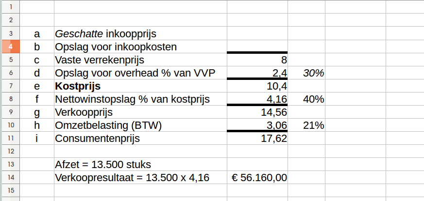

## 23 Nettowinstopslagmethode

#### 23.1 Berekening van de verkoopprijs bij de nettowinstopslagmethode

#### 23.2 Opslagpercentages

- Kosten (inkoop of overhead)
- Alle kosten bij elkaar optellen
- Delen door het aantal producten
- Dit zijn je kosten per product..
- Kosten per product delen door inkoopprijs (bij opslagpercentage inkoop) of vvp (bij opslagpercentage overheadkosten)

Voorbeeld:
- Parttime sales persoon 12.000 euro
- Marketingkosten 10.000 euro
- Juridisch 3.000 euro
- Management (parttime) 25.000 euro
- Stel 50.000 producten..
- Stel vvp = 1,80 euro

Overhead per product?

Opslagpercentage overheadkosten?

#### 23.3 Voorcalculatorische nettowinst bij nettowinstopslagmethode

- Voorcalculatie = schatting, voorspelling
- Nettowinst is verkoopprijs - kostprijs
- Kostprijs daarin zitten dus *alle* kosten
- Verkoopresultaat = afzet x nettowinst (per product)
- Verkoopresultaat = afzet x (verkoopprijs - kostprijs)

Voorbeeld:

Geschat wordt dat er in de maand februari 2018 13.500 eenheden van product 'Scruffy' (pluche hond) worden verkocht. De onneming verkoopt geen andere producten. De vvp = 8 euro, het opslagpercentage overheadkosten = 30%, het opslagpercentage nettowinst = 40%.

Hoe groot is het voorcalculatorische verkoopresultaat?

#### 23.4 Nacalculatorische nettowinst bij nettowinstopslagmethode

Gerealiseerde nettowinst:
- Methode 1: *werkelijke* opbrengst - *werkelijke* kosten
- Methode 2: Verkoopresultaat + budgetresultaat

Verkoopresultaat = Afzet x (verkoopprijs - kostprijs)

Budgetresultaat = Toegestane kosten - werkelijke kosten

Stel een winkel verkoopt "Scruffy's" voor 18,95 euro en zet er normaal 3000 in een maand af. Het opslagpercentage overheadkosten is 40% en het nettowinstopslagpercentage is 35%.

De verwachte inkoopprijs van een 'Scruffy' bedraagt 7 euro. De inkoopkosten (verwacht bedragen 1,29). In werkelijkheid werd er 6,75 betaald terwijl de inkoopkosten 1,40 bedroegen. Er zijn daadwerkelijk 3150 stuks verkocht.

- Gerealiseerde verkoopresultaat 
- Gerealiseerde budgetresultaat?
- Resultaat op inkopen & overheadkosten?

Controle? 3150 x 15,66 - 36.099 = ook 13.230 euro!

## Einde

[printbare versie](havo_hfd23.html?print-pdf)

[home](index.html)
