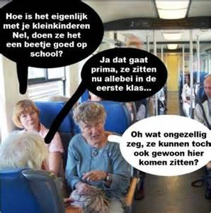

## Hoofdstuk 6 - Communicatieproces

#### 6.1 Definitie van communicatie

**Functies:**
- Geven van informatie
- Verkrijgen van informatie
- Beinvloeden houding of gedrag

_ZMBO - model_

**Z**ender

**M**edium

**B**oodschap

**O**ntvanger

Volledige weergave:

Boodschap:

1. Hoe wil ik overkomen?
2. Op welke manier benader ik de ontvanger(s)?
3. Wat zijn de gewenste reacties?

#### 6.2 Uitbreiding van het ZMBO-model

**Zender --> Boodschap**

**Coderen:** Idee, gedachten of gevoelens overbrengen. Eerst omzetten in een boodschap.

**Beperkingen?**

**Boodschap binnen medium**

**Boodschap --> Ontvanger**

**Interpreteren & Decoderen**

**Referentiekader:** 

--------
- Biologische factoren
- Ervaringen
- Milieu
- Opvoeding
- Opleidingen
---------
Gevoelens, ideeen, meningen, opvattingen, normen en waarden..

**Filter?**

**Feedback** (Ontvanger naar zender)
In de eerste instantie:
- Erkenning
- Begrip?

**Terugkoppeling**

Feedback op Feedback..

&nbsp;

**Follow-up**

Verder met de boodschap (eerste deel is begrepen)

#### Verstorende elementen in het ZMBO-model

#### Ruis
_"Ruis is iedere verstoring of ongunstige beinvloeding .. van een boodschap.."_

**Externe ruis:** Omgeving zorgt voor minder gunstige overdracht.

&nbsp;

**Interne ruis:** De oorzaak van de ruis ligt tussen de zender en de ontvanger met name bij het encoderen en decoderen.

**Non-intentonele ruis:** Onbedoeld

&nbsp;

**Intentionele ruis:** Bewust verstoren..

**Redundantie:** Overbodig

#### 6.3 Interculturele communicatie

**Cultuur:** Aangeleerd vanuit samen zijn in groep, collectief.

**Culturele dimensies (Hofstede):**
1. Machtsafstand
2. Femininiteit versus masculiniteit
3. Individualisme tegenover collectivisme
4. Onzekerheidsvermijding
5. Lange of korte termijnvisie

**Interculturele miscommunicatie**

#### 7 Communicatievormen

#### 7.1 Verbale en non-verbale communicatie

**Non-verbaal:**

- Houding
- Gebaren
- Mimiek
- Intonatie
- Vocale communicatie

#### 7.3 Gesprekken

**Halo-** effect: Het verwachtingspatroon van mensen is dat de persoon louter goeds kan doen.

**Horn-** effect: Het verwachtingspatroon van mensen is dat de persoon louter slechts kan doen.

**Stereotype**: Persoon binnen een bepaalde groep krijgt eigenschappen van die groep toegedicht (terecht/onterecht).

**Projectie**: Wanneer je iemand eigenschappen van jezelf toedicht.

**Suggestie(f)**: Wanneer je een bepaalde mening bij iemand plant of mensen worden in de mond legt.

file:///home/carl/Pictures/Selection_011.png

## Einde

[printbare versie](vwo_hfd7-8.html?print-pdf)

[home](index.html)