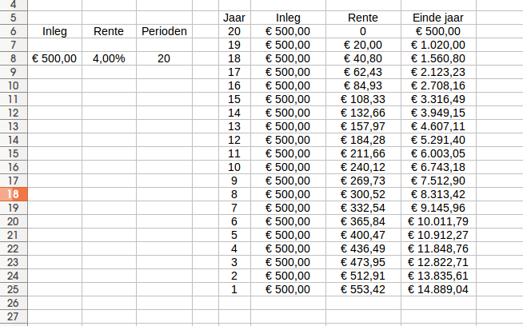
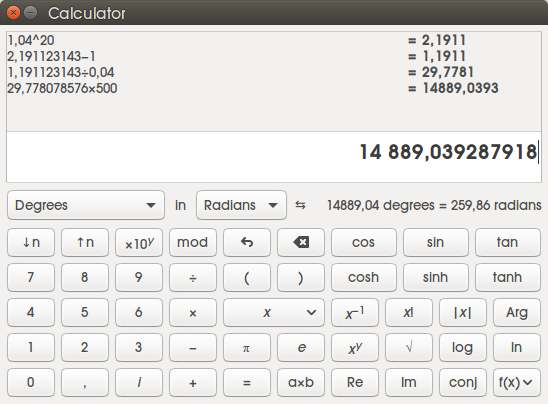
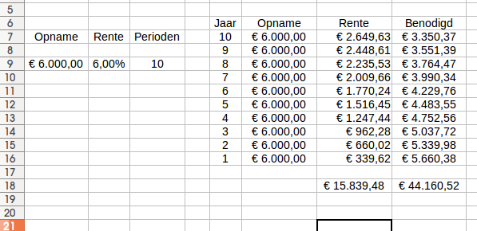
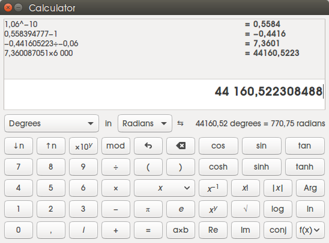

## 11 Renten

#### Voorkennis

Interest = rente

Interest-perunage (i) --> 5% = 5/100 = 0,05

**Enkelvoudige interest:**
- K . i = Interest in euro's (I)
- $$ Eindwaarde = (1+i) . K $$

_Bijvoorbeeld 1,05 . 1000 euro_

**Samengestelde interest:**
- $$ Eindwaarde = (1+i)^n . K$$
- $$ Interest = (1+i)^n . K - K$$

_Bijvoorbeeld:_ $$1,05^5 . 1000 euro$$

**Berekening van de contante waarde..**

_Je wil weten hoeveel geld je op de bank moet zetten om over 8 jaar 20.000 euro te hebben.. (De bank verstrekt 4% rente)_

**Hoe pak je dit aan?**

We hebben net gezien dat de formule was: 

$$ Eindwaarde = (1+i)^n . K$$

Dus: 

$$ Eindwaarde = (1,04)^8 . K = 20.000 euro$$

$$ 1,36856905 . K = 20.000 euro $$

$$ \frac{20.000}{1,36856905} = K = 14.614 euro $$

Deze formule mag je ook herschrijven:

$$ Eindwaarde = (1+i)^n . K$$

$$ \frac{Eindwaarde}{(1+i)^n} = K$$

$$ Eindwaarde . \frac{1}{(1+i)^n} = K$$

$$ Eindwaarde = (1+i)^{-n} . K$$

**Verdubbelingstijd**

Hier is een trucje voor zodat je het in je hoofd kan benaderen zonder rekenmachine. 

**Getal 70 delen door je percentage.** 
- 70 / 5% = 14 jaar
- $$ \frac{log2}{log1,05} = 14,206699083 $$
- Geschat = 14 jaar, exact is 14 jaar en 76 dagen

**Verdubbelingstijd**

Je kan ook de logaritmische functies van je rekenmachine gebruiken. Je tikt in: 

$$ \frac{log2}{log(1+i)}$$

of:

$$ \frac{ln2}{ln(1+i)}$$

#### 11.1 Berekening van de eindwaarde van een rente

Wat als je steeds per periode een bedrag wegzet tegen een uitstaande rente? 

Dus bijvoorbeeld je stort aan het einde van ieder jaar 500 euro op een rekening. Hoeveel is dat dan waard na 20 jaar bij een percentage van 4%?

**Oplossing:**

$$ Jaar 1 = 500 . 1,04^{19}$$

$$ Jaar 2 = 500 . 1,04^{18}$$

$$ Jaar 3 = 500 . 1,04^{17}$$
...

**Herschrijven:**

500 . $$(1,04^{19} + 1,04^{18} + ..)$$

**Spreadsheetprogramma:**

**Kan het ook anders? ...**

#### 11.3 Eindwaarde van een rente met een formule

**De somformule:**

$$ 500 . \frac{1,04^{20} - 1}{1,04 - 1} $$

**Op de rekenmachine:**

#### 11.2 Berekening van de contante waarde van een rente

Stel de rente per jaar is 6% en ik wil wanneer ik met pensioen ga 10 jaar lang ieder jaar 6000 euro op kunnen nemen om jaarlijks een mooie reis te maken..

Hoeveel moet ik dan storten voor die tijd?

6000 . 
$$ (1,06^{-10} + 1,06^{-9} + ..) $$

**Spreadsheetprogramma:**

**Kan het ook anders? ...**

#### 11.4 Contante waarde van een rente met een formule

** De contante waarde-formule:**

$$ C_{10} = \frac{1,06^{-10} - 1}{1,06^{-1} - 1}$$

**Op de rekenmachine:**

**Herschrijven: **

_Makkelijker ???_

_Postnumerando:_

$$ Termijn . \frac{1-(1+i)^{-n}}{i}$$

Invullen:

$$ 6000 . \frac{1-(1,06)^{-10}}{0,06} = 44.160,52$$

**Op de rekenmachine:**

_Prenumerando:_

$$ Termijn . (1+i) . \frac{1-(1+i)^{-n}}{i}$$

Invullen:

$$ 6000 . 1,06 . \frac{1-(1,06)^{-10}}{0,06} = 46.810,15$$

#### 11.5 Nominale en effectieve interest

Stel dat je voor iedere maand roodstand 1% rente moet betalen.

.. rente over rente .. 

$$ 1,01^{12} = 1,12682503 = 12,7\% $$
_effectief_

## Einde

[printbare versie](vwo_hfd11.html?print-pdf)

[home](index.html)