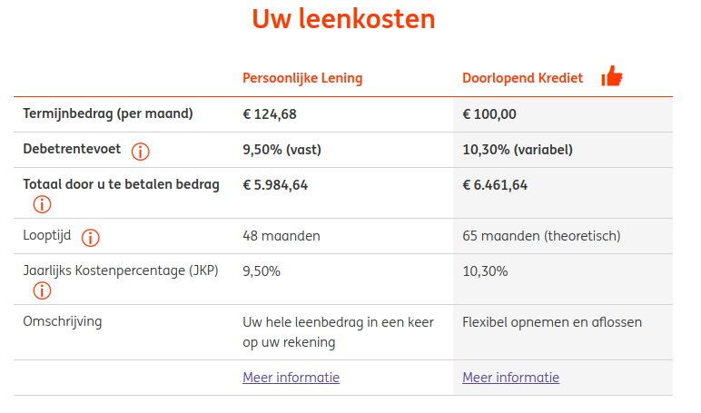

## Vreemd vermogen op korte termijn

#### 15.1 Leverancierskrediet

**Leverancierskrediet**: Vanuit de leverancier materialen geleverd krijgen waar je op een ander moment voor gaat betalen. 

**Productief leverancierskrediet**: In een productie-/handelsomgeving. De leverancier levert goederen/materialen aan een andere onderneming. Bedenk: _Betaaltermijn_ dus wezenlijk anders (vastgesteld) dan _crediteuren_..

Pluspunten:
- Lagere kosten dan bij bank
- Risico's lager door betere inschatting..
- Leverancier kent de branche!
- Lening volledig toegeschreven aan voorraad..

**Consumptief (leveranciers)krediet**

Voordelen voor leverancier (verlener):
- Koopdrempel verlagend!
- Binding van de klant, gehele duur van krediet.
- Minder administratiekosten dan bank, dus relatief goedkoop.
- Service naar klant toe (incident, gebrek aan spaargeld).
- Speelt in op product-levenscyclus, vernieuwing.
- Financieringskosten lucratief.
- Schulden zijn verhandelbaar.

**Doorlopend krediet**: 
- Krediet afgesproken met duur. 
- Gedurende de hele looptijd (oneindig?!) kan het afgeloste weer opgenomen worden. 
- Bedrag kan in delen worden opgenomen tot overeengekomen limiet. 
- Aan de rente wordt flink verdiend!

SNS bank 10-10-2017:

**Koop op afbetaling**:
- Direct eigenaar! (gebruik, vruchtgebruik, vervreemding)
- Gelijke termijnen terugbetalen
- Wel of niet rente betalen
- Minstens 20% aanbetaling
- Geldig vanaf tweede termijnbetaling

**Huurkoop**:
- Pas eigenaar bij laatste termijn
- Gelijke termijnen betalen
- Termijnen meestal iets hoger dan som/termijnen
- Geldig vanaf tweede termijnbetaling

_Incasso_
<section id="vid">
     <iframe src="http://www.youtube.com/embed/g2hCelKfUXQ?rel=0"
     frameborder="0" height="550" width="720"></iframe>
     </section>

**Persoonlijke lening**: 
- Krediet, betalingstermijnen en de interest afgesproken. 
- De lenende partij _neemt het volledige bedrag op_ (of krijgt het gestort op de lopende betaalrekening). 
- Er wordt dan in _gelijke termijnen_ steeds een deel terugbetaald, die de consument weer op zou kunnen nemen. 
- Hoogte van de lening staat contractueel _vast_.

ING Bank 10-10-2017 (PL van 5000 euro):

#### 15.3 Rekening-courant
- Maximum afgesproken, vrij opneembaar
- Betalen wanneer het uitkomt
- Daar staat (flink!) rente tegenover
- Steeds opnieuw opneembaar tot maximum
- _Dispositieruimte_: ruimte tussen max en saldo
- Interessant voor (kleine) bedrijven in fluctuerende omstandigheden
- Gevaar dat bank vertrouwen opzegt..

#### 15.4 Leasing

Verschil tussen _operational_ en _financial_ lease.

**Operational lease**:
- Korte termijn opzegbaar
- Bijdrage in verzekering en onderhoud
- Opnemen in de w&v-rekening als kosten
- Off balance omdat het geen eigen activa zijn

**Financial lease**:
- Schatting economische levensduur
- Op basis daarvan een overeenkomst
- Niet opzegbaar
- Onderhoud en verzekering voor eigen rekening
- Meestal na afloop voor klein bedrag te koop
- On balance omdat het als het ware een koop betreft

#### 16.1 Vragers van vermogen

Partijen: _Consumenten, overheden, ondernemingen_

Consumenten: ..

Ondernemingen: ..

Overheid: In de vorm van staatsobligaties, 

Wanneer de rente op een obligatie hoger is dan de marktrente dan drijft dat de prijs op, het tegenovergestelde is ook waar.

Dus:

Marktrente > Obligatierente --> --

Marktrente < Obligatierente --> ++

_Verwachting???_

#### 16.2 Aanbieders van vermogen (aanbodzijde)

Partijen: _Beleggers, spaarders, beleggingsfondsen, ondernemingen en overheden_

**Institutionele beleggers**:

Instituten die namers groepen grote sommen beleggen: 

_Pensioenfondsen, levensverzekeringen, beleggingsfondsen, hedgefondsen, ondernemingen en overheden_

**Pensioenfondsen**

**Spaarders via de bank**

**Beleggingsfondsen & Hedgefondsen**

**Ondernemingen**

**Overheden (ook lokaal)**

**Onderhandse leningen**

#### 16.3 Geldmarkt en kapitaalmarkt

Geldmarkt: Kort < 1 jaar

_Rekening-courant, leverancierskrediet, afnemerskrediet_

Kapitaalmarkt: > 1 jaar

_Aandelen, obligaties, onderhandse leningen_

_Openbare kapitaalmarkt_: 
- Aandelen, obligaties, 
- vrij verhandelbaar, 
- meerdere verstrekkers, 
- aanschaf via effectenbeurzen,
- Uitkeringen via bank 

Onderhandse kapitaalmarkt: 
- Een geldgever voor het gehele bedrag
- Kostenvoordeel (bank eruit)
- Lagere rente
- Rente- en aflossingsbetalingen makkelijker
- Geld terug na verstrijken van looptijd
- Minder/niet gevoelig voor fluctuaties!

Onderhands
<section id="vid">
     <iframe src="http://www.youtube.com/embed/lByzjW6GOFo?rel=0"
     frameborder="0" height="450" width="600"></iframe>
     </section>

#### 16.4 De Amsterdamse effectenbeurs

**Ontstaan in 1606** door monopolie van VOC op handel in Azie

**VOC** eerste bedrijf dat aandelen uitgaf

**AFM**: Autoriteit financiele markt, deze autoriteit ziet toe op naleving regels van zowel de kapitaal- als de geldmarkt.

**Emissiehuis**: Bank die namens bedrijven aandelen uitgeeft (emissie)

**Limietorder**: Koper stelt dan tegen welke prijs hij aandelen wil kopen, als de prijs bereikt wordt gaat hij over tot koop. Verkoper kan andersom ook wachten tot verkoop, eerst moet prijs gehaald worden.

**Marktorder**: Koop x aandelen tegen elke prijs.

## Einde

[printbare versie](vwo_hfd7-8.html?print-pdf)

[home](index.html)

https://goo.gl/forms/0FBkkFfoPO13io2M2
