## Strategische keuzes

#### Voorkennis

** Waar komt strategie vandaan?**

Oorlogvoering

_"..high level plan to achieve one or more goals under conditions of uncertainty"_

** In welke vakgebieden wordt het nog meer toegepast?**

Alle vormen van bedrijfskunde

Sport

Dienstverlening

** Marketing als onderdeel van bedrijfskunde..**

** Andere belangen dan marketingdoelstellingen?**

HRM?

Finance?

Corporate strategy?

Politics?

Fear of retaliation?

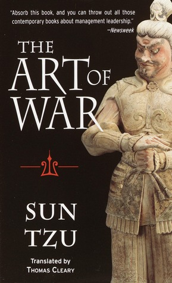

_Taking sh.. too seriously?_

#### 20.1 Concurrentieanalyse

#### Porter' 5 forces - model
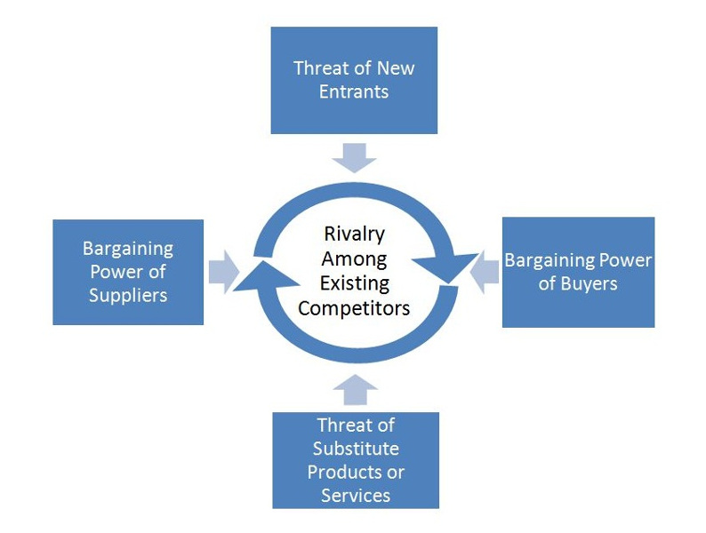

** Verticale / 
horizontale concurrentie (1): **

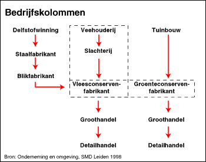
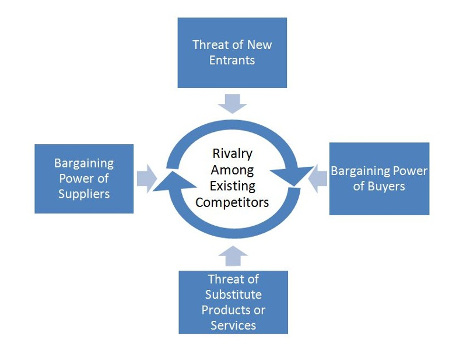

** Verticale / 
horizontale concurrentie (2): **

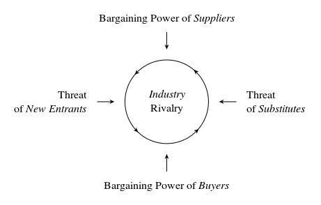

** Concurrentie binnen de bedrijfstak**
- Productdifferentiatie
- Marktcapaciteit (capaciteit =< vraag?)

** Potentiele toetreders**
- Kapitaalintensiteit
- Schaalvoordelen
- Distributiekanalen
- _Specialisatie_
- _Patenten, convenanten_

** Substituten**

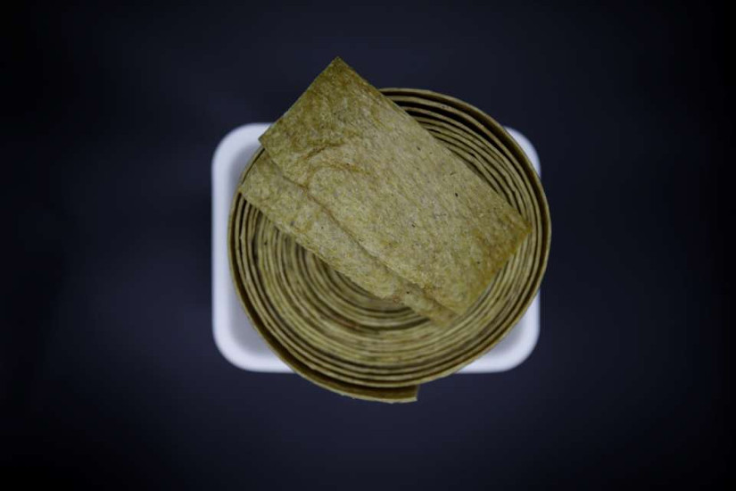

_injogogi 'man-made-meat'_

** Kopers**
- Prijsgevoeligheid
- Beschikbaarheid van informatie
- Relatieve belang (pressure)

** Leveranciers**

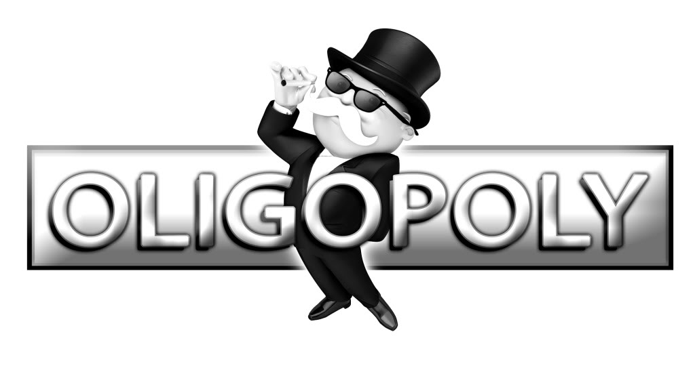

#### 20.2 Marktanalyse

** 3C Model:**

Een onderneming is in belangrijke mate afhankelijk van..

Customers

Corporation

Competition

** Customers**
- Productgebruik (Hoe, wanneer, waarom)
- Consumenttypes (Wie, waar)

** Corporation**
- Imago
- Kostenstructuur
- _Denk aan al die P's van de vorige les.._

**Competition**

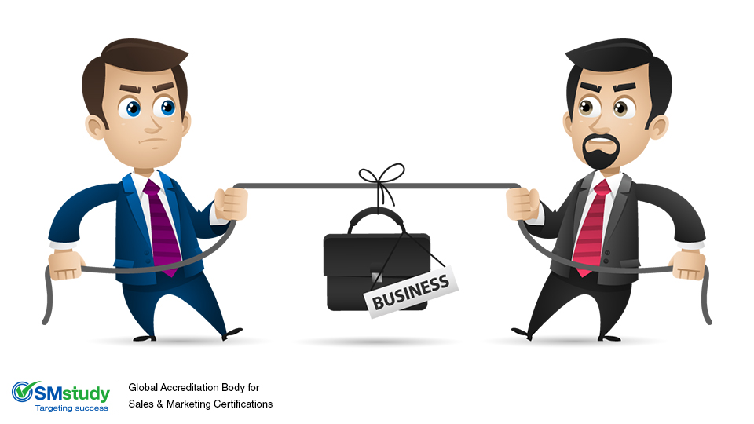

#### 20.3 Product-marktstrategieen

** SWOT:**
- Strenghts; _(Sterkten)_
- Weaknesses; _(Zwakten)_
- Opportunities; _(Kansen)_
- Threats; _(Bedreigingen)_

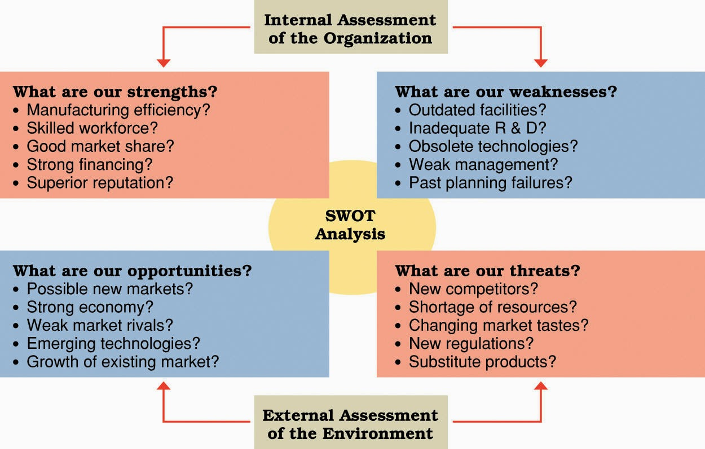

_TOWS_

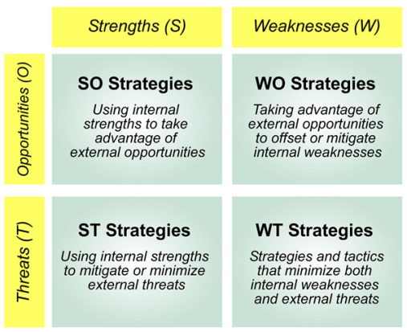

** Groeimatrix / Ansoff-matrix**

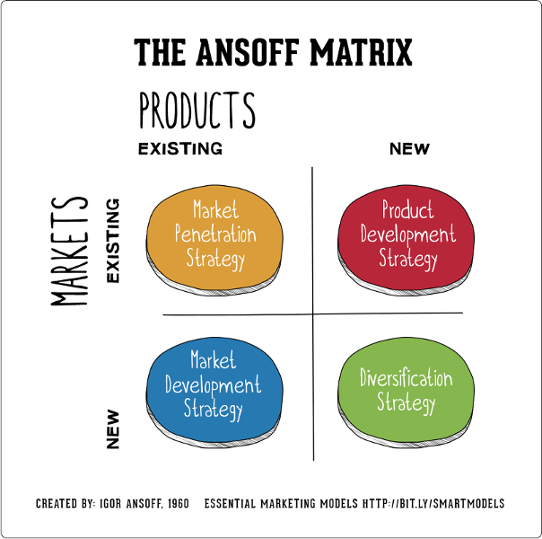

**Marktpenetratie:**
- Bestaande markt, bestaand product..
- Groeifase van een product..
- Andere goede reden?

**Productontwikkeling:**
- Bestaande markt, nieuw product..
- Is er een aanleiding om te denken dat..
- Rijpheids/verzadigingsfase?
- Modificatie?!

**Marktontwikkeling:**
- Nieuwe markt, bestaand product..
- Marktonderzoek..
- Modificatie?!

**Diversificatie:**
- Nieuwe markt, nieuw product..
- Grote veranderingen binnen het bedrijf
- Onzekerheid

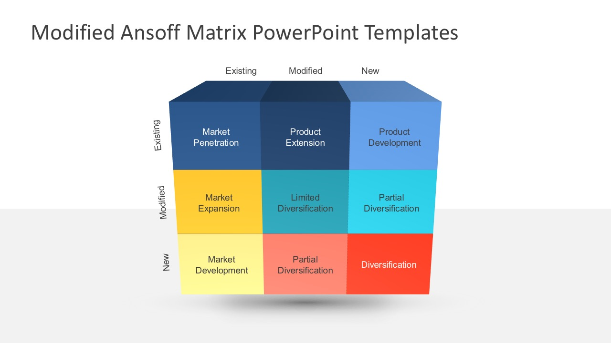

#### 20.4 Portfolioanalyse

**Boston Consulting Group (BCG)**
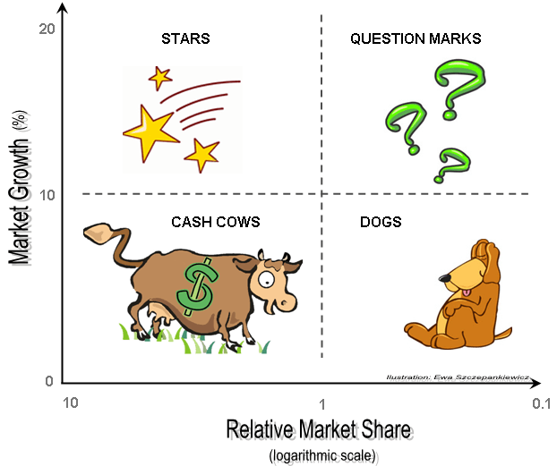

#### 20.6 Kosten van media en promotie

20.6 Vragen..
- Wie is de doelgroep?
- In welke vorm(en) communiceer je het beste?
- Welk(e) mediatype(n) zet je daar voor in?

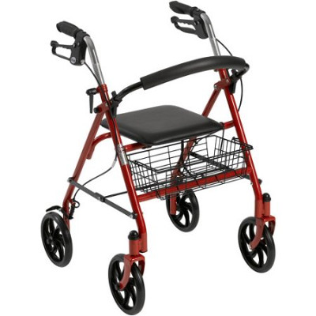
- Doelgroep?
- Welke vorm van communicatie?
- Welke mediatypen?

## Einde

[printbare versie](vwo_hfd20.html?print-pdf)

[home](index.html)