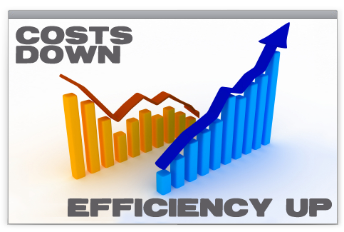
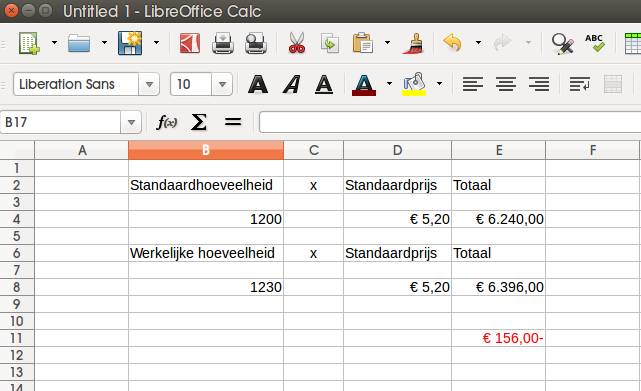
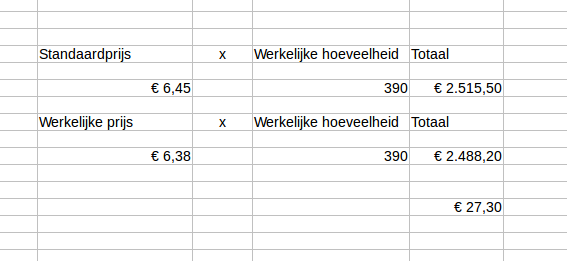
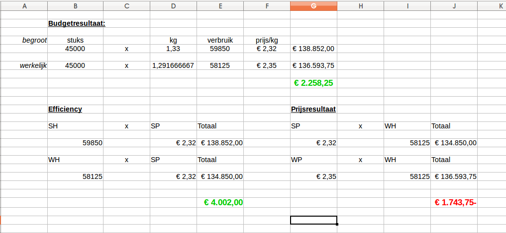

#### Resultaten in de industriele onderneming

**Voorcalculatie = verwachting =**

**toegestaan = standaard = normaal**
- Verwachting ten aanzien van de werkelijke hoeveelheid grondstoffen (efficiency)
- Verwachting ten aanzien van de werkelijke prijs grondstoffen (prijsresultaat)

#### 28.1 Efficiencyresultaten

Formule Efficiency-resultaat:

$$ (standaardhoev-werkelijkehoev)~x~standaardprijs $$

$$ (sh-wh)~x~sp $$

$$ (sh-wh)~x~sp $$

_Stel:_
_De norm voor het produceren van goed X is 1200kg grondstof per week tegen een standaardprijs van 5,20. Echter wordt er deze week 1230kg verbruikt._

Wat is het efficiencyresultaat?

Formule: $$ (1200 - 1230 )~x~5,20 = -156 $$

Onder elkaar:

#### 28.2 Prijsresultaten

Formule Prijsresultaat:

$$ (standaardprijs-werkelijkeprijs)~x~werkelijke hoev. $$

$$ (sp-wp)~x~wh $$

_Stel:_
_De standaardprijs grondstof voor het produceren van goed X is 6,45 euro de werkelijke prijs is echter 6,38. Begroot was dat er 400kg gebruikt zou worden. In werkelijkheid is er 390kg gebruikt._

Wat is het prijsresultaat?

$$ (sp-wp)~x~wh $$

$$ (6,45 - 6,38)~x~390 = 27,30 euro $$

of 

**Budgetresultaat**

- Budget bestaat uit zowel de prijs als de hoeveelheid!
- Dus vergelijkingen maken..
- Weet je twee uit drie (budgetresultaat, prijsresultaat, efficiency) dan weet je de derde ook.

_Stel:_
_Een afdeling maakt deze maand 45.000 artikelen. Daartoe verbruiken ze 58.125kg grondstof. De grondstofkostprijs was 2,35 euro/kg. De standaarkostprijs van een product is 1330 gram a 2,32/kg._

- Wat is het budgetresultaat?
- Wat is het efficiencyresultaat?
- Wat is het prijsresultaat?

#### 28.3 Resultaten op constante kosten

**Bezettingsresultaat: Constante kosten toeschrijven aan geproduceerde (of te produceren) hoeveelheid vermenigvuldigd met de bezetting.**
- Geproduceerde eenheden
- (Machine-)uren

$$ (Begroot - Normaal)~x~\frac{Constante~kn}{Normaal} $$

$$ (Werkelijk - Normaal)~x~\frac{Constante~kn}{Normaal} $$

$$ Bezetting~x~Constante~kn/p.e. $$

$$ (Begroot > Normaal)~x~\frac{Constante~kn}{Normaal}$$

 = voordelig **voor**calculatorisch resultaat.

$$ (Begroot < Normaal)~x~\frac{Constante~kn}{Normaal}$$

= nadelig **voor**calculatorisch resultaat. 

$$ (Werkelijk > Normaal)~x~\frac{Constante~kn}{Normaal}$$

 = voordelig **na**calculatorisch resultaat.

$$ (Werkelijk < Normaal)~x~\frac{Constante~kn}{Normaal}$$

= nadelig **na**calculatorisch resultaat. 

_Voorbeeld:_
Stel dat de normale productie 50.000 eenheden is en een eenheid kost een half uur om te maken. In werkelijkheid zijn er maar 40.000 eenheden geproduceerd en hebben de machines 21000 uren aangestaan. Een machine-uur kost steeds 25 euro. De constante machinekosten waren 640.000 euro (werkelijk).

- Efficiency?
- Prijsresultaat?
- Budgetresultaat?

Blz 25 (Voorbeeld 28.5)

## Einde

[printbare versie](vwo_hfd28.html?print-pdf)

[home](index.html)