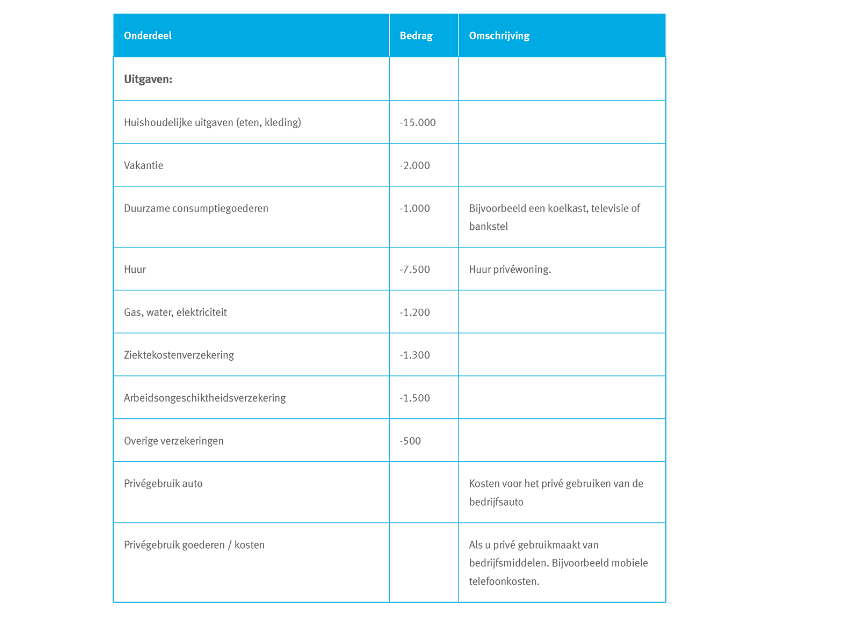

## Informatieanalyse: Ondernemingsplan & MVO

#### 38.1 Persoonlijk plan

#### Persoonlijk plan
Een persoonlijk plan geeft inzicht in wie de ondernemer is. De ondernemer is natuurlijk onderdeel van de onderneming en wordt meegenomen in de interne analyse.

Denk aan:
- Persoonsgegevens
- Motivatie en doelstellingen
- Eigenschappen van de ondernemer
- Bestaande netwerken
- Ervaringen en inzichten
- Inkomensafhankelijkheid

#### 38.2 Marketingplan

#### Marketingplan
Een marketingplan is het concreet maken van hoe je de markt wil veroveren.

Denk aan:
- Marktonderzoek!
- Haalbaarheidsanalyse (anders dan in financiele zin)
- Interne/externe analyse (bijvoorbeeld SWOT)
- Ansoff, Porter, BCG, etc enz.
- 4c's (customers solutions, cost 2 consumer, convenience, communication)

#### 38.3 Financieel plan
Een financieel plan brengt de financiele haalbaarheid van de onderneming in kaart. Voorbeeld: https://qredits.nl/academy/financieel-plan/

Een financieel plan bestaat uit de volgende onderdelen:
- Investeringsbegroting (H33)
- Financieringsbegroting (H33)
- Exploitatiebegroting (H33)
- Liquiditeitsbegroting (H33)
- Privebegroting (nieuw -> eenmanszaak/zzp)

#### 38.4 Organisatieplan

#### Organisatieplan
Een organisatieplan wordt opgesteld om in kaart te brengen aan welke eisen/voorwaarden een onderneming moet voldoen om te kunnen bestaan.

Denk daarbij aan:
- Een goed gekozen rechtsvorm
- Huisvesting (bestemming?)
- Vergunningen (bestemming, omgeving, milieu)
- Belastingen (omzet, lonen)
- Personeel
- Verzekeringen (zie volgende slide)

#### 38.5 Maatschappelijk verantwoord ondernemen

#### Maatschappelijk verantwoord ondernemen
Centraal:
- People
- Planet
- Profit

https://www.youtube.com/watch?v=4CP-Xzmlu-Y

## Einde

[printbare versie](vwo_hfd38.html?print-pdf)

[home](index.html)
